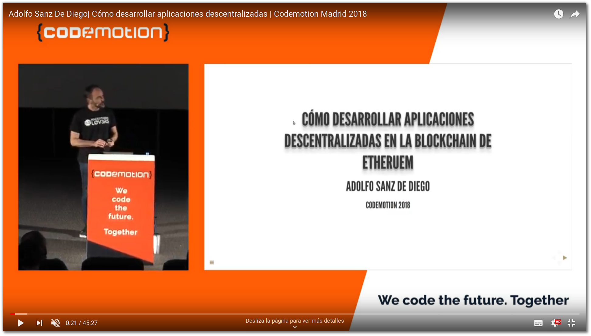
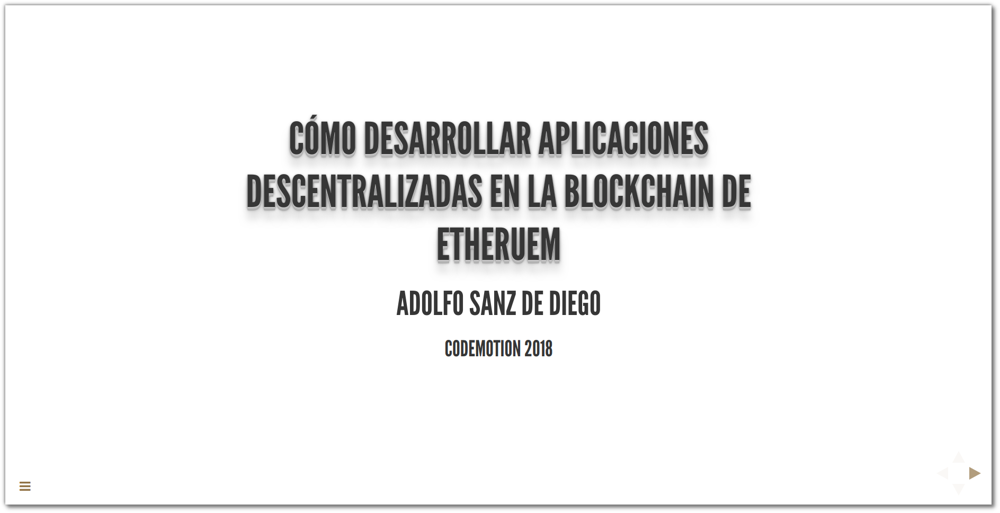

# Cómo desarrollar aplicaciones descentralizadas en la Blockchain de Ethereum

En esta charla práctica y nada teórica (bueno un poco si), pretendo mostrar el código necesario para desarrollar una pequeña aplicación descentralizada ([ÐApps](https://en.wikipedia.org/wiki/Decentralized_application)) con un pequeño contrato inteligente ([Smart Contracts](https://en.wikipedia.org/wiki/Smart_contract)) en la Blockchain de [Ethereum](https://www.ethereum.org/).

Veremos un poco de [Solidity](https://solidity.readthedocs.io/en/v0.4.24/), un lenguaje para programar contratos inteligentes. Utilizaremos también [Truffle](http://truffleframework.com/), un framework para desarrollar y testear aplicaciones descentralizadas. Necesitaremos usar [web3js](https://github.com/ethereum/web3.js/) para llamar desde nuestra web a la Blockchain. Usaremos [MetaMask](https://metamask.io/) para interactuar con la aplicación. Y para minar nuestras transacciones de prueba levantaremos una instancia de [Ganache](http://truffleframework.com/ganache/).

Es una charla de 45 minutos en donde presento resumir todo lo que yo he aprendido a base de golpes durante casi un año.

[Charla en el Codemotion](https://madrid2018.codemotionworld.com/conference/)

## Recursos

### Vídeo de la charla

[Vídeo de la charla](https://www.youtube.com/watch?v=P8W9YBqJnk0)

### Slides de la charla

[Slides de la charla](https://asanzdiego.github.io/codemotion-charla-blockchain/)

## Ejecución de la ÐApp

### Prerequisitos

Instalar NodeJS https://nodejs.org/

Instalar MetaMask https://metamask.io/

### Clonar el repositorio

Ejecutar:

~~~
git clone git@github.com:asanzdiego/codemotion-charla-blockchain.git
cd codemotion-charla-blockchain
~~~

### Instalar dependencias globales

Ejecutar:

~~~
npm install -g truffle
npm install -g ganache-cli
npm install -g @angular/cli
~~~

### Instalar dependencias del proyecto

Ejecutar en la carpeta del proyecto:

~~~
npm install
~~~

### Ejecutar ganache (nodo privado)

Ejecutar en la carpeta del proyecto en una consola separada:

~~~
ganache-cli --gasLimit 7000001
~~~

### Compilar y migrar los contratos al nodo privado

Ejecutar en la carpeta del proyecto en una consola separada:

~~~
truffle compile && truffle migrate
~~~

### Testear los contratos contra el nodo privado

Ejecutar en la carpeta del proyecto en una consola separada:

~~~
truffle test
~~~

### Arrancar el front

Ejecutar en la carpeta del proyecto en una consola separada:

~~~
ng serve
~~~

### Abrir la aplicación

En un navegador con MetaMask instalado abrir: <http://localhost:4200/>.

Ejemplo en <https://nongovernmentalorganizations.github.io/>.

### Para desarrollar

Recomiendo [Visual Studio Code](https://code.visualstudio.com/) con el [plugin de Solidity de Juan Blanco](https://marketplace.visualstudio.com/items?itemName=JuanBlanco.solidity)
